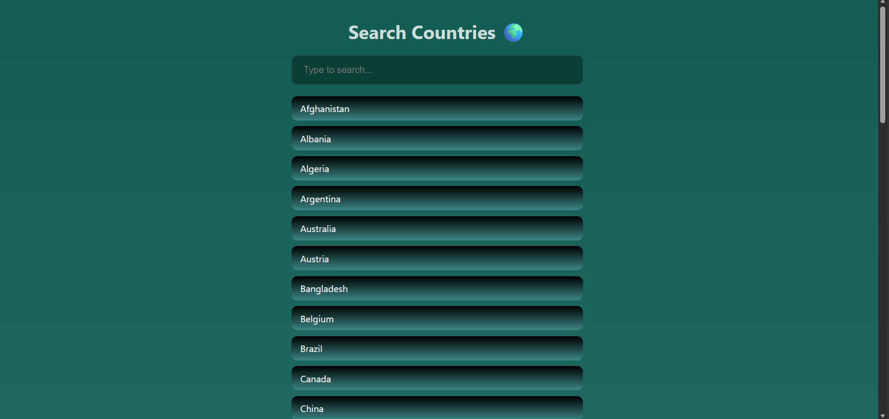

# Live Country Search 🌍

A simple and responsive live search app built with **HTML, CSS, and JavaScript**.

The project allows users to search through a list of countries and see matching results while typing.

## ✨ Features

* Live search results while typing
* Search countries by name
* Case-insensitive search
* Displays all countries when the search field is empty
* Shows a message when no results are found
* Debounced search for better performance
* Responsive design for different screen sizes

## 🛠️ Built With

* HTML5
* CSS3
* JavaScript
* DOM Manipulation
* Array Filtering
* Debounce

## 📸 Screenshot



## 🌐 Live Demo

[View Live Demo](https://elenahedayat.github.io/live-search-countries/)

## 📁 Project Structure

```text
live-country-search/
│
├── index.html
├── style.css
├── script.js
└── README.md
```

## 🚀 How to Run

1. Clone the repository:

```bash
git clone https://github.com/elenahedayat/live-search-countries.git
```

2. Open the project folder.
3. Open `index.html` in your browser.

No additional installation or dependencies are required.

## 👩‍💻 Author

**Elena Hedayat**

[GitHub](https://github.com/elenahedayat)
